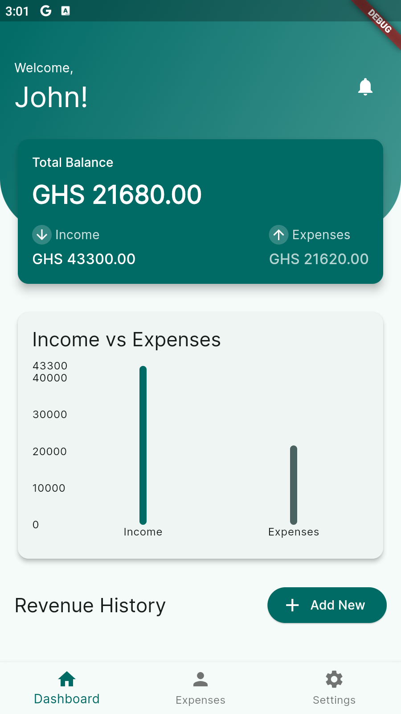
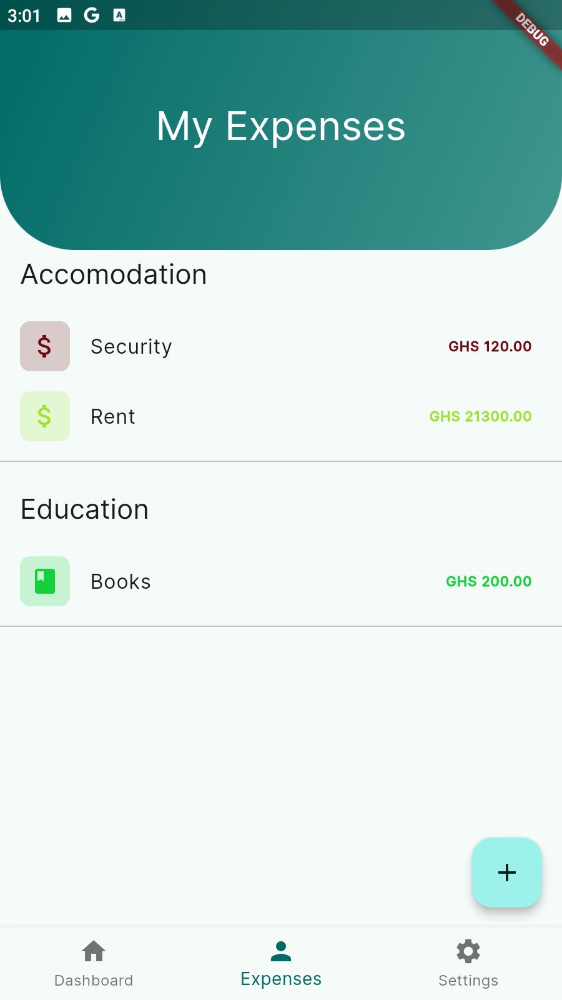
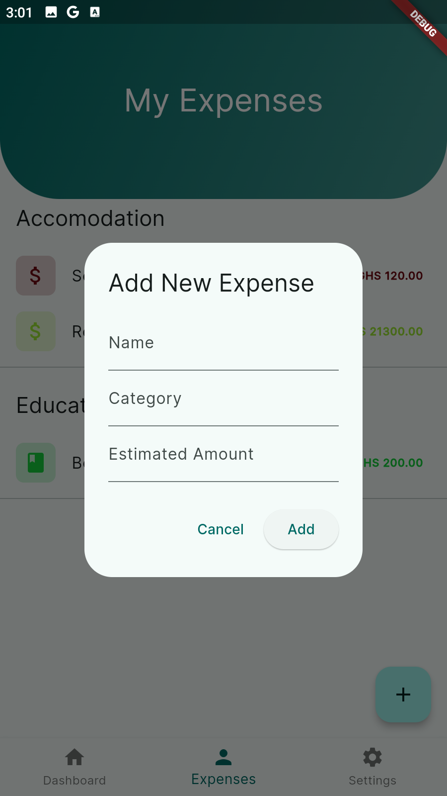
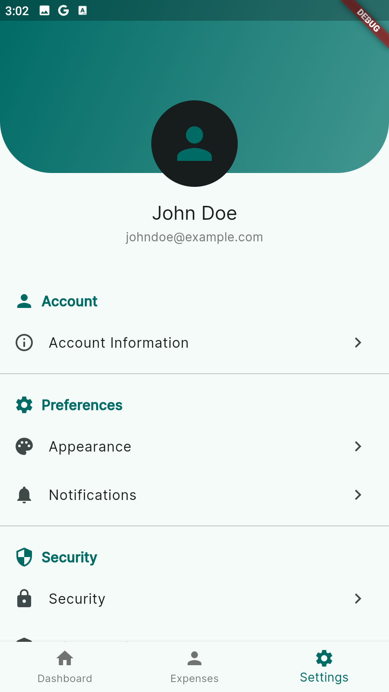

# Expense Tracker

Expense Tracker is a cross-platform Flutter application designed to help users efficiently manage their personal finances. With an intuitive interface, it allows you to track income, expenses, and view insightful analytics to make better financial decisions.

## Screenshots

### Home Screen


### Expenses Screen


### Add Expense Dialog


### Profile Screen


## Features

- **Dashboard**: Overview of total balance, income, and expenses
- **Income & Expense Tracking**: Add, edit, and delete transactions
- **Categorized Expenses**: Organize spending by categories
- **User Authentication**: Secure login and registration
- **Theme Customization**: Light, Dark, and System modes
- **Charts & Analytics**: Visualize your spending patterns

## Getting Started

Follow these steps to set up and run the project locally for development and testing.

### Prerequisites

- [Flutter](https://flutter.dev/docs/get-started/install) (version 2.0 or later)
- [Dart](https://dart.dev/get-dart) (version 2.12 or later)
- An IDE (e.g., [Android Studio](https://developer.android.com/studio), [VS Code](https://code.visualstudio.com/))

### Installation

1. **Clone the repository:**
   ```sh
   git clone https://github.com/gid-code/expense_tracker.git
   ```
2. **Navigate to the project directory:**
   ```sh
   cd expense_tracker
   ```
3. **Install dependencies:**
   ```sh
   flutter pub get
   ```

### Running the App

1. Ensure you have an emulator running or a physical device connected.
2. Run the app:
   ```sh
   flutter run
   ```

## Running Tests

To run unit and widget tests:
```sh
flutter test
```

## Built With

- [Flutter](https://flutter.dev/) - UI framework
- [Provider](https://pub.dev/packages/provider) - State management
- [go_router](https://pub.dev/packages/go_router) - Navigation
- [fl_chart](https://pub.dev/packages/fl_chart) - Charts and graphs

## Contributing

Contributions are welcome! Please open an issue or submit a pull request for any improvements or bug fixes.

## License

This project is licensed under the MIT License. See the [LICENSE](LICENSE) file for details.
